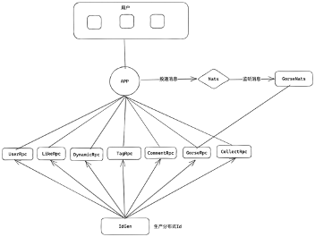

    <h2 align="center">知否项目后端</h2>

## 技术栈

 - Golang
 - Go-Zero
 - gRPC
 - MySQL
 - MongoDB
 - Redis
 - Docker
 - k8s

## 说明
此仓库只是将各个代码模块进行聚合，方便使用Github Action
完整的代码在[Gitea](https://git.154896.xyz/zhifou)

## 项目架构

